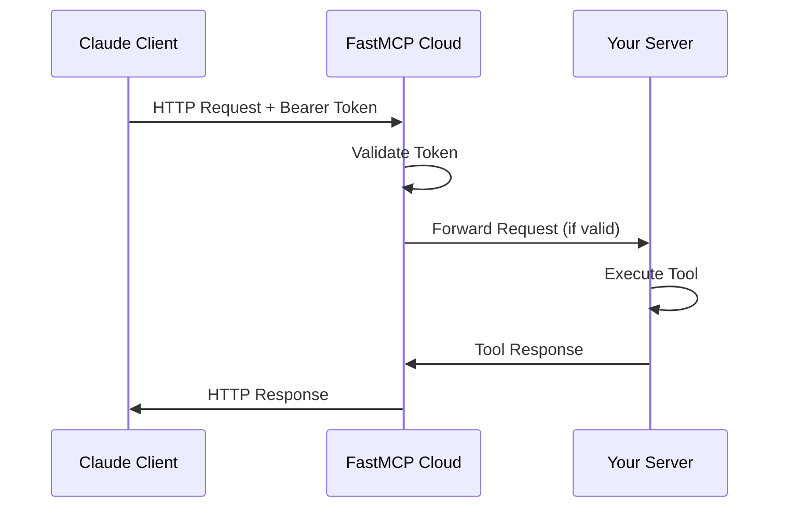

# MCP Arena Deployment Guide

## Overview

MCP Arena provides a comprehensive set of research, financial, and analysis tools through both local and cloud deployment options using FastMCP.

## Architecture

### Local Development
```
[Claude Desktop] ←--stdio-→ [MCP Server] ←--local-→ [Tools & APIs]
     │                           │
     └── Local config file       └── All tools available locally
```

### Cloud Deployment
```
[Claude Desktop/Web] ←--HTTPS-→ [FastMCP Cloud] ←--HTTP-→ [Your MCP Server]
     │                              │                        │
     └── Bearer token auth          └── Auto-scaling         └── All tools available
                                        Load balancing          
```

## Prerequisites

### What You Need
- ✅ **GitHub account** (free)
- ✅ **This repository** pushed to GitHub
- ✅ **5 minutes** for deployment

### What You Don't Need
- ❌ Credit card or payment
- ❌ Server management knowledge
- ❌ Docker experience
- ❌ Complex configuration

## Step-by-Step Deployment

### Phase 1: Prepare for Cloud Deployment

1. **Commit and push your current changes:**
   ```bash
   git add .
   git commit -m "Deploy MCP Arena to cloud"
   git push origin main
   ```

2. **Verify deployment files exist:**
   - ✅ `pyproject.toml` - Streamlined dependencies
   - ✅ `cloud_server.py` - Simplified cloud entrypoint
   - ✅ `src/server.py` - Unified server with HTTP/stdio support
   - ✅ `mcp_server.py` - Local development wrapper

### Phase 2: Deploy to FastMCP Cloud

1. **Sign up for FastMCP Cloud:**
   - Go to https://fastmcp.cloud
   - Click "Sign in with GitHub"
   - Authorize the application

2. **Create a new project:**
   - Click "Create Project"
   - Select your GitHub repository
   - Choose project settings:
     - **Name**: `mcp-arena` (or your preferred name)
     - **Entrypoint**: `cloud_server.py`
     - **Authentication**: Enable (recommended)
   - Click "Deploy"

3. **Wait for deployment:**
   - FastMCP Cloud will:
     - Clone your repository
     - Detect dependencies from `requirements.txt`
     - Build your server
     - Deploy to a unique URL
   - This takes 1-3 minutes

4. **Get your deployment URL:**
   - Access your workspace at: `https://fastmcp.cloud/dro-serve`
   - Your deployment URL will be: `https://your-project-name.fastmcp.app/mcp`
   - Copy the authentication token from the workspace dashboard

### Phase 3: Configure Client Access

#### Option A: Claude Desktop (Recommended)

1. **Open Claude Desktop configuration:**
   - macOS: `~/Library/Application Support/Claude/claude_desktop_config.json`
   - Windows: `%APPDATA%\\Claude\\claude_desktop_config.json`

2. **Add cloud server configuration:**
   ```json
   {
     "mcpServers": {
       "mcp-arena-local": {
         "command": "uv",
         "args": ["run", "python", "test_mcp.py"],
         "cwd": "/path/to/mcp_arena"
       },
       "mcp-arena-cloud": {
         "type": "http",
         "url": "https://your-project-name.fastmcp.app/mcp",
         "authorization_token": "your-token-here"
       }
     }
   }
   ```

3. **Restart Claude Desktop**

#### Option B: Direct API Integration

```python
import httpx
import asyncio

async def test_cloud_server():
    async with httpx.AsyncClient() as client:
        response = await client.post(
            "https://your-project-name.fastmcp.app/mcp",
            headers={
                "Authorization": "Bearer your-token-here",
                "Content-Type": "application/json"
            },
            json={
                "jsonrpc": "2.0",
                "id": 1,
                "method": "tools/list",
                "params": {}
            }
        )
        print(response.json())

# Test the connection
asyncio.run(test_cloud_server())
```

## Behind the Scenes: Technical Deep Dive

### How FastMCP Cloud Works

1. **GitHub Integration:**
   ```
   GitHub Repository → FastMCP Cloud Builder → Container Image
   ```
   - Monitors your repository for changes
   - Automatically rebuilds on git push
   - Creates separate deployments for pull requests

2. **Dependency Detection:**
   ```python
   # FastMCP Cloud reads requirements.txt
   requirements_scan() → dependency_resolution() → container_build()
   ```
   - Scans `requirements.txt` for Python dependencies
   - Resolves versions and installs in isolated environment
   - Builds lightweight container with your code

3. **Server Initialization:**
   ```python
   # When FastMCP Cloud starts your server:
   from cloud_server import mcp  # Imports your server instance
   server.start(transport="http", host="0.0.0.0", port=8000)
   ```

### Transport Layer Differences

#### Local (stdio) vs Cloud (HTTP)

**Stdio Transport (Local):**
```python
# Direct process communication
stdin/stdout ←→ MCP Protocol ←→ Tool Functions
```
- **Pros**: Zero latency, full debugging access
- **Cons**: Single client, local only

**HTTP Transport (Cloud):**
```python
# Network-based communication
HTTP Request → JSON-RPC → MCP Protocol → Tool Functions → HTTP Response
```
- **Pros**: Multiple clients, global access, scalable
- **Cons**: Network latency, requires authentication

### Authentication Flow



1. **Client** sends HTTP request with Bearer token
2. **FastMCP Cloud** validates the token
3. **Your Server** receives authenticated request
4. **Tool execution** happens in your server
5. **Response** flows back through the chain

### Error Handling and Monitoring

**Cloud-Specific Error Handling:**
```python
# In cloud_server.py
@mcp.tool(description="Health check endpoint for monitoring")
def health_check() -> str:
    return "MCP Arena server is healthy and running"
```

**Log Aggregation:**
- All server logs are captured by FastMCP Cloud
- View logs in the dashboard for debugging
- Structured logging with timestamps

## Local vs Cloud Feature Matrix

| Feature | Local Development | Cloud Deployment |
|---------|------------------|------------------|
| **Startup Time** | Instant | 1-3 minutes |
| **Access** | Local only | Global HTTPS |
| **Authentication** | None required | **MANDATORY Bearer token** |
| **Scaling** | Single process | Auto-scaling |
| **Debugging** | Full access | Log viewing |
| **Dependencies** | Local Ollama required | All handled in cloud |
| **Cost** | Free | Free (beta) |
| **Updates** | Manual restart | Auto-deploy on git push |
| **Memory Tools** | Full vector memory | **Disabled** (no local Ollama) |
| **Document Tools** | Full search & storage | **Disabled** (no vector DB) |
| **Security** | Development mode | **Production security** |

## Available Tools

### 📊 Research & Analysis
- **`web_search()`** - Web search via DuckDuckGo  
- **`analyze_url()`** - Webpage content extraction and analysis
- **`arxiv_search()`** - Academic paper search with full text extraction

### 💰 Financial & Economic Data  
- **`get_stock_overview()`** - Real-time stock, crypto, and market data
- **`analyze_canadian_economy()`** - Canadian economic indicators and analysis

### 🎬 Media Analysis
- **`analyze_youtube_url()`** - YouTube video transcription and analysis

### 🌍 Location & Weather
- **`get_weather()`** - Weather forecasts by location
- **`get_tide_info()`** - Canadian coastal tide information

### 🏙️ Toronto Data
- **`get_toronto_crime()`** - Toronto neighborhood crime statistics  
- **`list_toronto_neighbourhoods()`** - Complete list of Toronto neighborhoods

### 🔧 System
- **`health_check()`** - Server health monitoring (cloud only)

### Deployment Benefits
- ✅ **No local dependencies** - All tools work in both local and cloud modes
- ✅ **Stateless operation** - Optimized for serverless deployment  
- ✅ **Real-time data** - All tools fetch current information
- ✅ **Automatic scaling** - Cloud deployment handles load automatically

## Dependency Management Strategy

### Optimized pyproject.toml Structure

**Core Dependencies (Always Installed):**
- Essential for all MCP server functionality
- Includes: FastMCP, HTTP clients, data processing, visualization
- Automatically installed by FastMCP Cloud from `pyproject.toml`

**Optional Dependencies:**
```bash
# For local development with full UI and vector memory
uv sync --extra local

# For development and testing
uv sync --extra dev

# For cloud deployment (minimal - mostly core deps sufficient)
uv sync --extra cloud
```

### FastMCP Cloud Dependency Detection

**How it works:**
1. FastMCP Cloud automatically detects `pyproject.toml`
2. Installs all core dependencies from `[project.dependencies]`
3. Ignores optional dependencies (reducing deployment time and container size)
4. Your server gracefully handles missing optional dependencies

**Benefits:**
- **Faster deployments** - Only essential dependencies installed
- **Smaller containers** - No Streamlit, ChromaDB, or testing deps in cloud
- **Better security** - Fewer packages = smaller attack surface
- **Cost optimization** - Reduced memory usage and startup time

### Local Development Commands

```bash
# Install core dependencies (matches cloud deployment)
uv sync

# Install with local development extras (Streamlit UI)
uv sync --extra local

# Install with development tools (testing, etc.)
uv sync --extra dev

# Install everything
uv sync --all-extras
```

## Configuration Options

### Environment Variables

Create `.env.cloud` for cloud-specific settings:
```bash
# Server Configuration
HOST=0.0.0.0
PORT=8000

# Security
ENABLE_AUTH=true
ENABLE_CORS=true
CORS_ORIGINS=*

# Logging
LOG_LEVEL=INFO

# Tool-specific settings
YOUTUBE_MAX_TOKENS=24000
MCP_RETRY_MAX_ATTEMPTS=3
```

### FastMCP Cloud Settings

**Auto-deployment settings:**
- **Branch**: `main` (configurable)
- **Build trigger**: Every git push
- **Health check**: `/health` endpoint
- **Timeout**: 30 seconds for tool responses

**Resource limits (beta):**
- **Memory**: 512MB - 2GB (auto-scaling)
- **CPU**: Shared instances
- **Storage**: Ephemeral (resets on deployment)

## Troubleshooting

### Common Issues

1. **"Module not found" error:**
   ```bash
   # Check requirements.txt includes all dependencies
   cat requirements.txt
   # Ensure proper Python package structure
   ls -la src/
   ```

2. **Authentication failures:**
   ```bash
   # Verify token format (should be JWT-like string)
   echo $AUTH_TOKEN | wc -c  # Should be 200+ characters
   # Check token expiration in FastMCP Cloud dashboard
   ```

3. **Tool execution timeouts:**
   ```python
   # For long-running tools, add timeout handling
   import asyncio
   
   async def long_running_tool():
       try:
           result = await asyncio.wait_for(slow_operation(), timeout=30)
           return result
       except asyncio.TimeoutError:
           return "Operation timed out, try a smaller request"
   ```

### Debug Mode

**Enable verbose logging:**
```bash
# Set in .env.cloud
LOG_LEVEL=DEBUG

# Or via environment variable
export LOG_LEVEL=DEBUG
```

**Local testing of cloud configuration:**
```bash
# Test HTTP mode locally
python -m src.server http 8000

# Test with curl
curl -X POST http://localhost:8000/mcp \
  -H "Content-Type: application/json" \
  -d '{"jsonrpc":"2.0","id":1,"method":"tools/list","params":{}}'
```

## Monitoring and Maintenance

### Health Monitoring

FastMCP Cloud automatically monitors:
- **Response times** for all tool calls
- **Error rates** and failure patterns  
- **Memory usage** and performance metrics
- **Uptime** and availability

### Maintenance Tasks

**Regular updates:**
```bash
# Update dependencies
uv sync --upgrade
git add uv.lock requirements.txt
git commit -m "Update dependencies"
git push  # Auto-deploys to cloud
```

**Monitor logs:**
- Visit FastMCP Cloud dashboard
- View real-time logs and metrics
- Set up alerts for errors (coming soon)

## Cost Analysis

### Current Costs (2025)
- **FastMCP Cloud**: $0 (free during beta)
- **GitHub**: $0 (public repositories)
- **Total monthly cost**: $0

### Expected Post-Beta Pricing
- **Hobby tier**: ~$5-10/month (estimated)
- **Pro tier**: ~$20-50/month (estimated)
- **Enterprise**: Custom pricing

### Cost Optimization Tips
1. **Use efficient tools** - minimize API calls
2. **Cache results** - leverage built-in caching
3. **Monitor usage** - track tool execution patterns
4. **Optimize dependencies** - remove unused packages

## Security-First Design

### Mandatory Authentication
**🔒 Authentication is ALWAYS ENABLED for cloud deployment - this cannot be disabled.**

- ✅ **No open access mode** - all cloud deployments require authentication
- ✅ **FastMCP Cloud manages tokens** - automatic generation and validation  
- ✅ **Bearer token security** - industry-standard authentication
- ✅ **Per-project isolation** - each deployment has unique authentication

### Security Best Practices
- ✅ Never commit tokens to version control
- ✅ Rotate tokens regularly (monthly recommended)  
- ✅ Use environment variables for secrets
- ✅ Monitor access logs for suspicious activity
- ❌ **Never disable authentication** in cloud mode

### Network Security
- ✅ HTTPS encryption (handled by FastMCP Cloud)
- ✅ CORS configuration for web clients
- ✅ Rate limiting (built into FastMCP Cloud)
- ✅ Input validation in all tools

### Data Privacy
- ✅ No persistent storage of user data
- ✅ Ephemeral containers (data cleared on redeploy)
- ✅ Logs rotated automatically
- ✅ EU/US data residency options (enterprise)

## Migration Strategy

### Gradual Migration Approach

**Week 1: Setup & Testing**
- Deploy to cloud alongside local setup
- Test all tools work correctly
- Configure authentication

**Week 2: Parallel Usage**
- Use both local and cloud based on needs
- Monitor performance differences
- Gather user feedback

**Week 3+: Primary Cloud Usage**
- Use cloud as primary deployment
- Keep local for development and testing
- Monitor costs and performance

## Support and Community

### Getting Help
- **FastMCP Documentation**: https://gofastmcp.com/
- **GitHub Issues**: Create issues in your repository
- **MCP Community**: Join the Model Context Protocol community
- **Discord/Forums**: (Links available on FastMCP website)

### Contributing Back
- Share your tools with the community
- Submit bug reports and feature requests
- Contribute to MCP ecosystem documentation

---

## Quick Reference Commands

```bash
# Local Streamlit UI
uv run streamlit run app.py

# Local MCP server (for Claude Desktop)
uv run python mcp_server.py

# Test HTTP mode locally  
uv run python -m src.server http 8000

# Test cloud server locally
uv run python cloud_server.py

# Deploy to cloud (automatic on git push)  
git add .
git commit -m "Deploy updates"
git push origin main
```

## Summary

**MCP Arena now provides:**
- ✅ **Unified architecture** - One codebase for local and cloud
- ✅ **Simplified deployment** - Streamlined dependencies and configuration  
- ✅ **Real-time tools** - No local dependencies, works everywhere
- ✅ **Easy development** - Streamlit UI for testing and development

**🎉 Ready for both local development and global cloud deployment!**